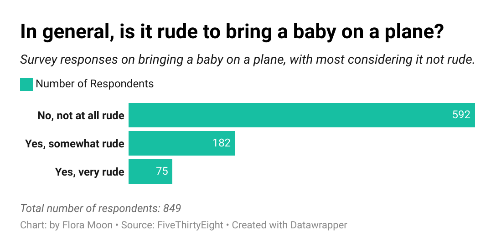

### Quiz-Week-4

# Flying Etiquette Survey

## About the Survey
The Flying Etiquette Survey conducted by *FiveThirtyEight* gathers opinions from travelers on various behaviors and situations encountered during flights. The survey includes questions about reclining seats, switching seats, bringing children on planes, and other common in-flight scenarios. The goal of the survey is to understand the general consensus on what is considered polite or rude behavior while flying.

## Selected Question : In general, is it rude to bring a baby on a plane?
I chose the question **"In general, is it rude to bring a baby on a plane?"** because it addresses a common debate among travelers. In Korea, where I was born, there is a growing trend of _'no-kids zones'_ in cafes and restaurants, which indirectly discriminates against children and parents. This is contradictory to the government's efforts to increase the birth rate, which is currently the lowest in the world. The debate over _'kids zones'_ versus _'no-kids zones'_ extends to airplanes as well. According to a 2017 Skyscanner survey, 91% of Korean adults supported the introduction of _'kids zones'_ on planes.

Globally, the decline in birth rates is a trend, and the United States has also seen a steady decrease in birth rates in recent years. I wanted to see if Americans would have similar views to Koreans on this topic. This question provides insights into societal attitudes towards family inclusivity and tolerance in shared public spaces.

Reference:
- [Skyscanner Survey on Travelling with Children](https://www.skyscanner.co.kr/news/survey/travelling-with-your-children-survey)
- [United States Birth Rate Data](https://www.macrotrends.net/global-metrics/countries/USA/united-states/birth-rate)
- [서울경제 기사: 노키즈존](https://m.sedaily.com/NewsView/29UN55IA7V)
- [브런치: 노키즈존에 대한 이야기](https://brunch.co.kr/%40prestigegorilla/448)

## Findings
The chart below shows the responses to the question. It reveals that <ins>the majority of respondents (592, 69.7%) do not consider it rude to bring a baby on a plane,</ins> while a smaller number (182, 21.4%) find it somewhat rude, and a few (75, 8.8%) find it very rude. This results demonstrate a general tolerance towards families traveling with young children in U.S. However, there is still a notable portion of respondents who find it somewhat or very rude, indicating that this remains a contentious topic. Understanding these perspectives can help improve the travel experience for all passengers by fostering empathy and better accommodation for families.

---

## Summary
- **Not at all rude**: 592 respondents (69.7%)
- **Somewhat rude**: 182 respondents (21.4%)
- **Very rude**: 75 respondents (8.8%)

**Total number of respondents: 849**

## Source
Citation: FiveThirtyEight  
Source: [FiveThirtyEight Flying Etiquette Survey](https://github.com/fivethirtyeight/data/tree/master/flying-etiquette-survey)

